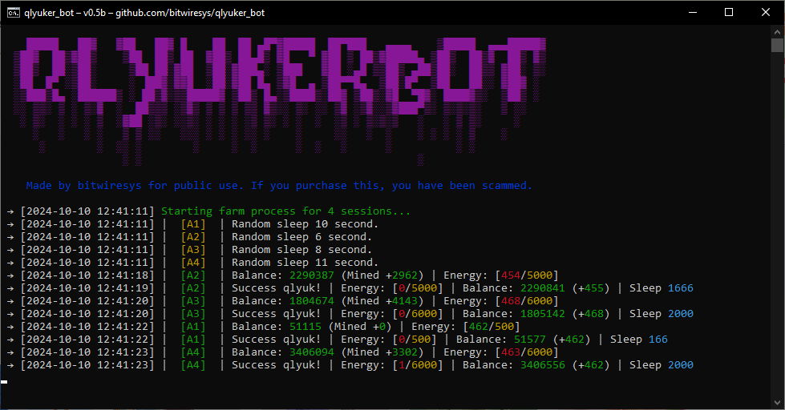

# 🕊️ qlyuker_bot

**qlyuker_bot** is a Telegram bot designed for the game "Клюкер." This bot automatically levels up your pigeon while it pecks at seeds. 🥳🌱
---

---

## ⚙️ Setup

### **Telegram API Configuration**
To connect to your account, you'll need the following values for authorization:

- **api_id**: Your Telegram API ID
- **api_hash**: Your Telegram API Hash

### **Bot Settings**
Here are the configurable options for the bot:

- **tap_count**: `0` (default)  
  Maximum taps based on energy reserves.  
  *Description: Number of taps per session.*

- **random_tap_count**: `TRUE` (default)  
  *Description: Randomized number of taps per session.*

- **sleep_per_tap**: `0` (default)  
  *Description: Sleep duration before the next session for energy recovery.*

- **random_sleep_per_tap**: `TRUE` (default)  
  *Description: Random sleep duration before the next session.*

- **min_save_energy**: `0` (default)  
  *Description: Minimum energy the bot will retain (turns off restriction).*

- **min_save_balance**: `0` (default)  
  *Description: Minimum balance the bot will retain (turns off restriction).*

- **use_auto_upgrades**: `TRUE` (default)  
  *Description: Enable automatic upgrades.*

- **max_upgrade_lvl**: `0` (default)  
  *Description: Maximum level of upgrades (turns off restriction).*

- **max_upgrade_cost**: `0` (default)  
  *Description: Minimum upgrade cost (turns off restriction).*

- **min_upgrade_profit**: `0` (default)  
  *Description: Minimum profit from upgrades (turns off restriction).*

- **use_daily_energy**: `TRUE` (default)  
  *Description: Use daily rewards.*

---

## 🚀 Quick Start

1. **Install Dependencies**  
   For Windows, run `INSTALL.bat`.  
   For Linux, run `install.sh`.

2. **Start the Bot**  
   - On Windows: Run `START.bat` or execute `python main.py` in the console.  
   - On Linux: Run `start.sh`.

### 📋 Prerequisites
Ensure you have the following installed:
- Python version **3.8 or higher**.

---

## 🔑 Getting API Keys

1. Go to [my.telegram.org](https://my.telegram.org) and log in with your phone number.
2. Select **API development tools** and fill out the registration form for a new application.
3. Record the **API_ID** and **API_HASH** in the `.env` file provided after registering your application.

---

Feel free to contribute, report issues, or request features! Happy tapping! 🐦💖

--- 

### 📫 Contact
For any inquiries or support, please reach out via the GitHub issues page or directly contact me.

--- 

### ⭐️ Star this project!
If you like **qlyuker_bot**, please give it a star! It helps others find this project. 🌟
